# Roadmap — research program (12–24 months)

**Focal question:** How should the personal Cursor Pro orchestrator evolve so Other Models stay near ~$20/mo while science/stats silent-error risk falls and daily UX (plan→approve, RU `[route]`) stays friction-light?

**Decision owner:** Даниил · **Audience:** personal now → team later · **Config/docs language:** English · **User-facing route line:** Russian

Companion artifacts: [research/](research/README.md) (landscape, brainstorm D1–D12, hypotheses H1–H5).

This document is a **program plan**. Phase outcomes are not pre-validated findings.

## Hard gates (all phases)

1. Never use Claude Fable without explicit HITL confirmation.
2. Never treat a cheap-model answer as the final path for `science_stats`.
3. Daily path must remain inside Cursor (skill/SDK); no mandatory external gateway.
4. Prefer Auto/Router overlay for routine work; escalate by policy.

## Success metrics

1. Other Models $ / month vs naive frontier daily-drive
2. Share of tasks completed without escalation
3. Subjective science/stats error journal (trend down)

Weekly protocol: [research/README.md](research/README.md).

## Phase map

```mermaid
flowchart LR
  v0[v0_recommend] --> m0[Measure_4w_baseline]
  m0 --> v1[v1_role_subagents]
  v1 --> m1[Measure_refactor_and_mixed]
  m1 --> v2[v2_cascade_and_BoN_caps]
  v2 --> m2[Measure_science_journal]
  m2 --> v3[v3_budget_ops_BYOK]
  v3 --> v4[v4_learned_router_pilot]
  v4 --> v5[v5_team_packaging]
```

### Phase 0 — Stabilize + measure (now → ~4 weeks)

**Status:** v0 implemented (recommend-only skill + YAML).

- Commit and run [acceptance-v0.md](acceptance-v0.md)
- Weekly metrics + science journal
- Tune keyword false positives in classifier / skill
- Keep budget warn@80% + hard-other block (`config/budget.yaml`)

**Aligns:** D1, D8 · **Tests:** H1 (exploratory)

### Phase 1 — Execution helpers

- Spawn Task / Cursor SDK subagents with per-role models (scientist / reviewer / coder / verifier)
- Decompose mixed prompts into parallel roles
- Keep chat-switch hint (skill still cannot force picker)
- Optional GitNexus `detect_changes` after route on coding tasks

**Aligns:** D2, D9 · **Tests:** H2

### Phase 2 — Quality amplifiers under caps

- Code cascade: lint/tests gate then escalate (FrugalGPT-style for verifiable work)
- Prose/docs heuristic checklist before Other Models spend
- `/max` best-of-N with **hard monthly BoN cap**; forbidden in `/eco`
- AutoMix-like self-verify **only off** `science_stats` final path (D5 restricted)
- Science remains strong-first

**Aligns:** D3, D4, D5 (restricted), D6 · **Tests:** H3, H5

### Phase 3 — Ops

- Best-effort parse of Cursor usage into `budget.yaml`
- BYOK notes when Other Models empty (optional)
- Spend-controller polish (remaining-$ policy)

**Aligns:** D8

### Phase 4 — Learned router pilot (only if H1 plateaus)

- Export lean Hindsight routes + explicit feedback (≥200 labeled if possible)
- Offline RouteLLM-style binary strong/weak experiment (Cursor pool vs Other pool)
- A/B against rules on a holdout month
- **Do not** remove science hard-gate even if the learned router disagrees without human review

**Aligns:** D7 · **Tests:** H4  
**Risk:** OOD vs Arena-trained routers ([landscape note](research/llm-routing-landscape-2026-10.md))

### Phase 5 — Team packaging

- Share skill + YAML with documented policy
- English configs remain canonical
- Personal metrics should be stable before sharing defaults

**Aligns:** D10

## Parked

| ID | Why parked |
| --- | --- |
| D11 Local/offline models | Explicitly post-MVP; not needed for daily Cursor path |
| D12 LiteLLM/OpenRouter primary gateway | Conflicts with skill-first daily Cursor convenience |

## Literature anchors (located evidence — see landscape note)

- **RouteLLM:** single-call learned router; large bench savings; weak OOD without augmentation
- **FrugalGPT:** cascade + scorer; latency/token tradeoff; good when verifiable
- **AutoMix:** generate → self-verify → escalate; multi-call; not science final path here
- **Cursor Router:** full Cost/Balance/Intelligence primarily Teams/Enterprise; Pro keeps Auto — supports overlay strategy

## Non-goals (until explicitly requested)

- Claiming universal novelty or publishing causal results from N-of-1 weeks
- Training a production router on private prompts without your review
- Changing Cursor subscription tier as the “solution”
- Auto journal formatting for «Проблемы прогнозирования»
- Replacing plan→approve with fully autonomous long runs by default

## Revisit triggers

- Other Models ≥80% before mid-cycle
- Critical science-journal entry in a week
- Cursor product changes to Auto/Router for individuals
- H1 plateau → consider Phase 4 only
